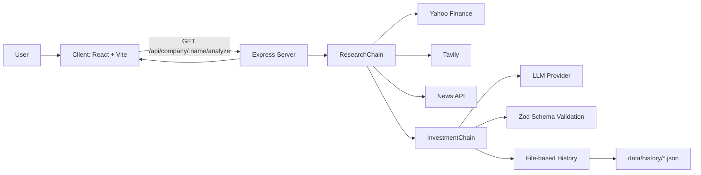

# AI Investment Research Agent

InsideIIM AI Investment Research Agent is a full-stack monorepo that turns a company name into a structured investment memo. The app fetches fundamentals, news, and web context, sends that context to an LLM for a JSON report, validates the result, and stores each completed analysis as a local history file.

## Overview

The product is split into three layers:

- `client/` is the React + Vite UI that lets a user search for a company, view the generated report, and browse saved analysis history.
- `server/` is the Express API that orchestrates research, LLM generation, schema validation, and report persistence.
- `data/history/` stores completed reports as JSON files, which act as the app's persistence layer.

There is no database in the current implementation. History is file-backed, which keeps the stack lightweight for a take-home project and makes saved reports easy to inspect.

## How To Run It

### Prerequisites

- Node.js 20 or newer is recommended.
- npm 10+.
- API keys for the external services you want to use.

### Install

```bash
npm install
```

### Environment Setup

The repo loads environment variables from both the repository root and the `server/` package.

Create or update these files:

- `.env` at the repo root
- `server/.env`
- `client/.env` if you want to override the client API base URL

Required and supported variables in the current codebase:

```bash
# Client
VITE_API_BASE_URL=http://localhost:4000

# Server runtime
NODE_ENV=development
PORT=4000
HOST=0.0.0.0
APP_NAME=AI Investment Research Agent
APP_VERSION=1.0.0
CORS_ORIGIN=http://localhost:5173
LOG_LEVEL=info

# External data sources
TAVILY_API_KEY=your_tavily_key
NEWS_API_KEY=your_newsapi_key

# LLM provider used by the current code
GROQ_API_KEY=your_groq_key
GROQ_MODEL=llama-3.3-70b-versatile
GROQ_TIMEOUT_MS=15000
GROQ_MAX_RETRIES=2
```

Note: some example env files in the repo still use `GEMINI_API_KEY` / `GEMINI_MODEL`, but the current backend provider reads `GROQ_*` variables in `server/src/providers/gemini.provider.js`. Use the `GROQ_*` names when running the app.

### Run

Open two terminals and run:

```bash
npm run dev:server
npm run dev:client
```

Or run the packages directly:

```bash
cd server
npm run dev

cd client
npm run dev
```

### Build And Lint

```bash
npm run build
npm run lint
```

## How It Works

1. The user enters a company name in the client.
2. The client calls `GET /api/company/:companyName/analyze`.
3. `ResearchChain` fetches company fundamentals from Yahoo Finance, then fetches web context from Tavily and news articles from News API in parallel.
4. `InvestmentChain` builds a structured prompt and sends it to the LLM provider.
5. The provider requests JSON output, the chain parses it, normalizes missing fields, and validates it with Zod.
6. The chain applies programmatic safeguards for `decisionBand`, `recommendation`, and `confidence`.
7. `HistoryService` writes the finished report to `data/history/<timestamp>-<ticker>.json`.
8. The client reads the history list and lets the user reopen any saved report.

Architecture flow:



### Backend Structure

- `controllers/` handle HTTP requests and responses.
- `routes/` define the public API surface.
- `services/` coordinate business logic and persistence.
- `chains/` orchestrate multi-step research and analysis workflows.
- `providers/` wrap third-party services like Yahoo Finance, News API, Tavily, and the LLM API.
- `validators/` define request and response contracts with Zod.
- `middleware/` handles request IDs, logging, errors, and 404s.

### Public API Surface

- `GET /api/health` returns service metadata.
- `GET /api/company/:companyName` returns normalized company fundamentals.
- `GET /api/company/:companyName/analyze` returns the full investment memo.
- `GET /api/history` returns saved analysis summaries.
- `GET /api/history/:id` returns one saved analysis file.
- `GET /api/test` is available for LLM-related manual testing.

## Key Decisions And Trade-offs

- File-based history was chosen instead of a database to keep the project simple, portable, and easy to inspect during review.
- The analysis result is forced into a strict JSON contract so the UI can render it consistently and safely.
- The chain normalizes missing fields before validation because LLM output can be incomplete even when the prompt is strict.
- External data sources are treated as optional inputs. If Tavily or News API fails, the app falls back to empty arrays instead of failing the whole request.
- Confidence is capped when live web/news context is missing, which keeps the recommendation more conservative.
- The backend code currently uses a Groq client for the structured LLM call, even though some UI text and older env examples still say Gemini. That naming mismatch is a trade-off from the current implementation and should be cleaned up later.

## Example Runs

These examples come from saved reports in `data/history/`.

| Company | Ticker | Score | Confidence | Decision Band | Recommendation |
| --- | --- | ---: | ---: | --- | --- |
| Apple Inc. | AAPL | 70 | 65 | CONSIDER | PASS |
| Tesla, Inc. | TSLA | 85 | 65 | INVEST | PASS |
| Microsoft Corporation | MSFT | 75 | 65 | CONSIDER | PASS |
| Mirae Asset Tiger Google Value Chain ETF | 0190Y0.KS | 40 | 40 | PASS | PASS |

What the agent produced in practice:

- Apple Inc. was scored as a `CONSIDER` case because the model found decent fundamentals, but confidence stayed capped at 65, so the final recommendation was `PASS`.
- Tesla, Inc. reached an `INVEST` score band, but the same confidence safeguard kept the final recommendation at `PASS`.
- Microsoft Corporation landed in `CONSIDER` with a balanced score profile and the same confidence cap.
- The ETF case produced a `PASS` result because the available data was too sparse to support a stronger recommendation.

## What I Would Improve With More Time

- Replace file-based history with a real database and add migrations.
- Unify the provider naming and environment keys so the docs, UI, and backend all use one model/provider label.
- Add integration tests around the research chain, schema normalization, and error handling.
- Add caching for repeated ticker/company lookups.
- Add background jobs so history writes and long-running external calls do not block the request path as much.
- Add authentication, per-user saved reports, and watchlists.
- Share one generated schema between the backend and frontend instead of keeping separate copies.
- Add observability for external API latency, retry rates, and schema validation failures.

## Project Structure

```text
client/   React UI, report visualizer, API client, and app shell
server/   Express API, research chains, providers, validators, and history storage
shared/   Shared package scaffold for common contracts
data/     Saved analysis history JSON files
docs/     Project notes, decisions, and development logs
```

## Notes

- The `data/history/` folder is part of the app state. Removing those files removes the saved analysis history.
- The backend logs schema validation failures when the LLM output does not match the expected contract, which is useful for debugging provider or prompt issues.
